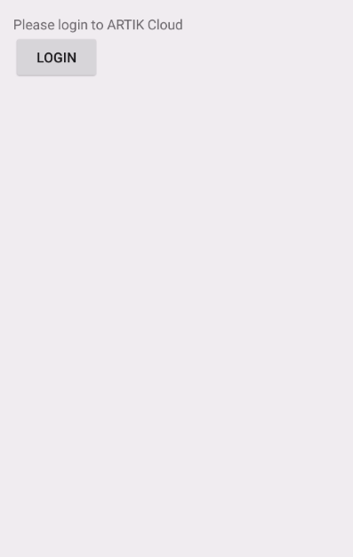
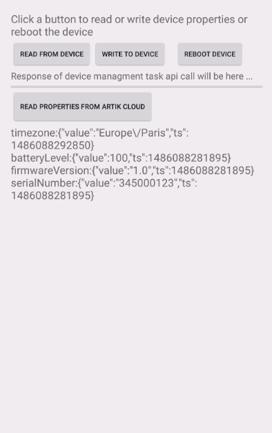
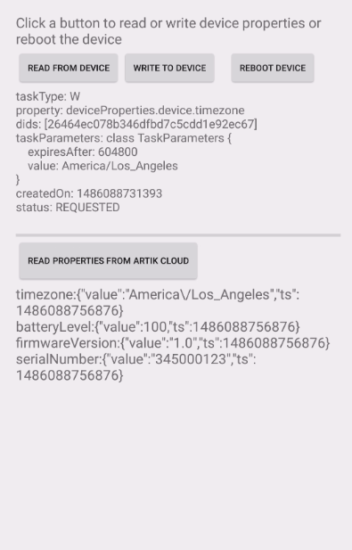
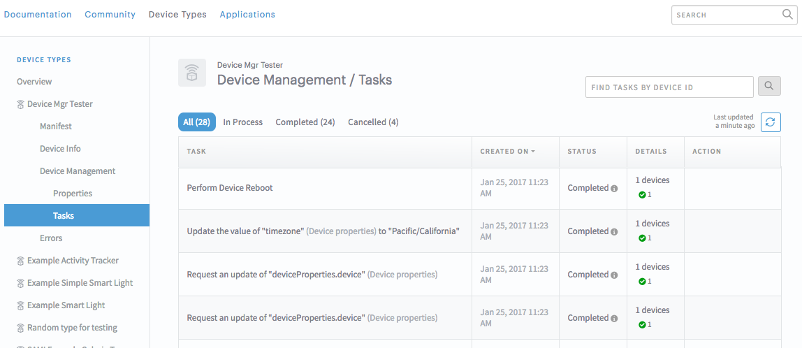

# Android App manages a remote lwm2m device

Let's build an Android application to manage remote devices that are connected to ARTIK Cloud via LWM2M.

After completing this sample, you will learn how to use [ARTIK Cloud device management task APIs](https://developer.artik.cloud/documentation/device-management/device-management-tasks.html) to:
- read device properties from a remote device 
- write device properties to a remote device
- execute on a remote device (for example reboot)

## Requirements
- Android Studio
- [ARTIK Cloud Java SDK](https://github.com/artikcloud/artikcloud-java)

## Setup / Installation

### Setup at ARTIK Cloud

 1. [Create a device type](https://developer.artik.cloud/documentation/tools/web-tools.html#creating-a-device-type) (or use the one you already own) in the [Developer Dashboard](https://developer.artik.cloud/).   

 2. Enable [Device Management Properties](https://developer.artik.cloud/documentation/advanced-features/device-management.html#device-management-in-the-developer-dashboard) for your device type. You do this in the [Device Type Dashboard](https://developer.artik.cloud/dashboard/devicetypes)—> Select Your Device Type —> Select Device Management —> Click "Enable Device Properties".

 3. Follow [these instructions](https://developer.artik.cloud/documentation/tools/web-tools.html#creating-an-application) to create an application. For this Android app, select the following:
 - Under “AUTHORIZATION METHODS”, check “Client credentials, auth code, implicit”.
 - Set “AUTH REDIRECT URL” to myapp://redirect.
 - Under “PERMISSIONS”, check “Read” for “Profile”.
 Get the [client ID](https://developer.artik.cloud/documentation/tools/web-tools.html#how-to-find-your-application-id), which you will need later.

 4. At [My ARTIK Cloud](https://my.artik.cloud/), [Connect a device](https://developer.artik.cloud/documentation/tools/web-tools.html#connecting-a-device) (or use the one you already own) of the device type. Get the [device ID and token](https://developer.artik.cloud/documentation/tools/web-tools.html#managing-a-device-token), which you will need later.

### Setup Android project

 1. Clone this sample repository
 2. In Android Studio, import this project. 
 3. Update Config.java file. In this file, replace the placeholders with your own device ID, device type ID, and client ID, which you get when [setting up in ARTIK Cloud](#setup-at-artik-cloud).

Now build the project, which will download the ARTIK Cloud SDK JAR from [Maven Central Repository](http://search.maven.org/). Deploy the APK to an Android phone. You can play with the app and LWM2M client emulator like in the demo. 

## Demo

 1. On the terminal, run the following command to start a [LWM2M Client emulator](https://github.com/artikcloud/artikcloud-lwm2m-c):

   ```
   %> akc_client -n -u coaps://coaps-api.artik.cloud:5686 -d YOUR_DEVICE_ID -t YOUR_DEVICE_TOKEN
   ```
   The device (lwm2m client) is now connected to ARTIK Cloud. Once the device receives and responds to the LWM2M operations from ARTIK Cloud, it prints out the info in the terminal. 
 2. Launch the app on your Android phone. 
 3. Login using your account. <br />
   
 4. Click "READ PROPERTIES FROM ARTIK Cloud" to get the properties of the device from [Device Mirror](https://developer.artik.cloud/documentation/advanced-features/device-management.html#device-mirror) in ARTIK Cloud. Some properties are shown on the screen as the following: <br />
   
 5. Click one of the three buttons on the top to request reading the properties from, writing a new timezone to, or rebooting the remote LWM2M device. The following shows the case of writing "America/Los_Angeles" timezone to the device. The remote LWM2M device acts on operation as following output in the terminal:
 
   ```
   > Resource Changed: /3/0/15
   ```
   On the Andriod app, click "READ PROPERTIES FROM ARTIK Cloud" and observe that the response from ARTIK Cloud confirms that the timezone has changed on device and on Device Mirror of ARTIK Cloud.<br />
   
 6. Go to Developer Dashboard and see the status of the tasks initiated by the Android app as the following:<br />


## More about ARTIK Cloud

If you are not familiar with ARTIK Cloud, we have extensive documentation at https://developer.artik.cloud/documentation

The full ARTIK Cloud API specification can be found at https://developer.artik.cloud/documentation/api-spec

Check out advanced sample applications at https://developer.artik.cloud/documentation/samples/

To create and manage your services and devices on ARTIK Cloud, create an account at https://developer.artik.cloud

Also see the ARTIK Cloud blog for tutorials, updates, and more: http://artik.io/blog/cloud

## License and Copyright

Licensed under the Apache License. See [LICENSE](LICENSE).

Copyright (c) 2017 Samsung Electronics Co., Ltd.
